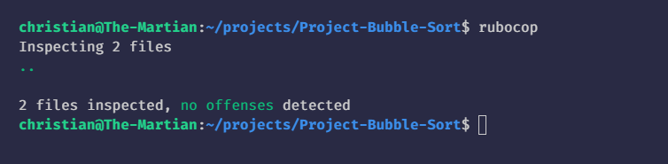

 

  

  <h3 align="center">Advanced Building Blocks - Bubble Sort</h3>

  

    A custom version of Ruby's yield method.
     
    <a href="https://github.com/mikenath223/Project-Bubble-Sort/README.md"><strong>Explore the docs 📚</strong></a>
     
     
    🖊️
    <a href="https://www.theodinproject.com/courses/ruby-programming/lessons/advanced-building-blocks">Assigment</a>
    🐛
    <a href="https://github.com/mikenath223/Project-Bubble-Sort/issues">Report Bug</a>
    🙏
    <a href="https://github.com/mikenath223/Project-Bubble-Sort/issues">Request Feature</a>
  

## Advanced-Building-Blocks--- Bubble Sort

In this project, we are implemented the bubble sort algorithm. We focused on the use of yield and passing a block to a method.

## Validations

Rubocop:

## Features

* using methods accepting a block using yield() and #call
* `module` keyword

## Built With

* `ruby` v2.5.5+
* RVM
* `vscode` with _Ruby_ and _Rubocop_ extensions

## Authors

**Michgolden Ukeje**

- GitHub: [@mikenath223](https://github.com/mikenath223)
- Twitter: [@Michgolden_Nath](https://twitter.com/MichgoldenU)
- LinkedIn: [Ukeje Michgolden](https://https://www.linkedin.com/in/michgoldenukeje/)
   

**Christian Otieno**
- GitHub [Christian](https://github.com/ChristianOtieno)

# License

This project is licensed under the MIT License - see the [LICENSE.md](LICENSE.md) file for details 

<!-- ACKNOWLEDGEMENTS -->
## Acknowledgements

* [Microverse](https://www.microverse.org/)
* [The Odin Project](https://www.theodinproject.com/)
* [Readme header](https://github.com/collinsugwu/Microverse201-Enumerable-Methods)
